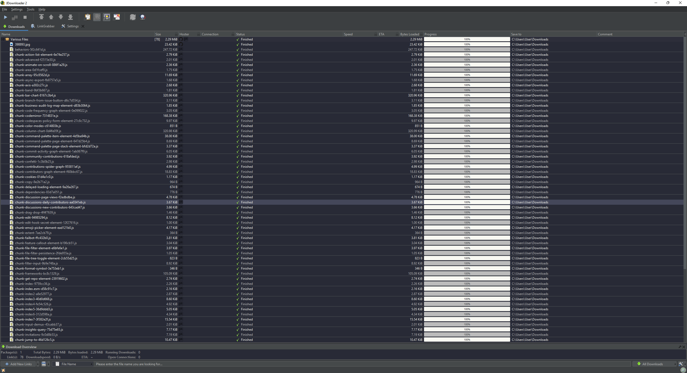

# Dracula for [JDownloader2](https://jdownloader.org/)

> A dark theme for [JDownloader2](https://jdownloader.org/).

## Install

1) In JDownloader2 go to Settings > Advanced Settings

2) Search for `GraphicalUserInterfaceSettings: Look And Feel Theme` and change the value from Default to `FLATAF_DRACULA`

3) Download the `FlatDraculaLAF.json` file and place it in `JDownloader\cfg\laf\`

4) Restart JDownloader2

## Team

This theme is maintained by the following person(s) and a bunch of [awesome contributors](https://github.com/dracula/foobar/graphs/contributors).

 |
--- |
[ixanza](https://github.com/ixanza) |

## License

[MIT License](./LICENSE)